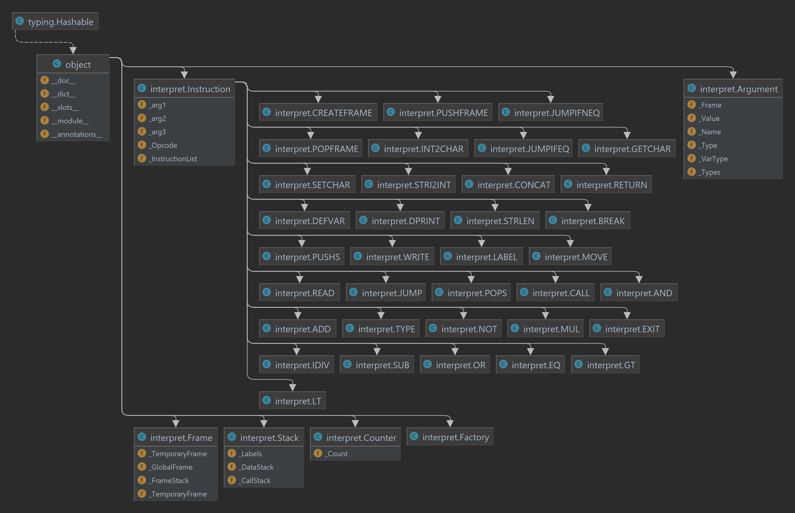

## Documentation of Project Implementation for IPP 2022/2023
### Name and surname: David Novak
### Login: xnovak2r

## About project
The goal was the creation of an object-oriented interpreter for the IPPcode23 language that would adhere to the Single 
Responsibility Principle as much as possible as well as PEP standards (mainly PEP 8 and PEP 484). 
I tried to implement classes with simple methods and give them names appropriate for their purpose. 
No extensions were implemented; however, the basic functionality has been implemented fully.

## General implementation
When the program starts, it first checks the arguments.
This is done with the combination of the **argparse** library and **argv** from the sys library.
I used argv because I was unable to force argparse to fail if another argument was passed to program alongside 
the help argument. 

After the argument check interpreter tries to open and parse the source XML while checking whether it complies 
with the IPPcode23 standards. During this check, the instructions and arguments are put into the correct order, 
and if the whole instruction seems correct, the `resolve` method of class `Factory` is called, which creates a specific 
underclass of the class `Instruction`, based on the opcode of said XML instruction. The instruction is then added 
to the list of instructions.

Once all the instructions are inside the instruction list, the interpreter loops through the list for the first time, 
executing any label instructions. This is done because of potential forward jumps. After this, the program loops 
through the instruction list for the second time, executing every instruction other than the instruction Label, 
since that would cause an error because a label of the same name would have been defined already.

## Classes

### Counter
Has a single attribute `_Count`, which is initialized to 0 and incremented after an instruction is executed.
It is used as an index to the `InstructionList` attribute of the class instruction when trying to find 
the next instruction to execute.

### Frame
The class that takes care of arguments of type `var` declared and/or defined in specific frames. It has 3 attributes 
which contain variables inside specific frames with temporary and local frames starting as uninitialized:
* **_GlobalFrame**: global variables inside the `GF` frame
* **_TemporaryFrame**: temporary variables inside the `TF` frame
* **_FrameStack**: Stack of pushed temporary frames with only the top one being regarded as the current `LF` frame

### Stack
Class Stack has 3 attributes of the type list with new values being added/removed to/from the end of the list:
* **_DataStack**: a stack of values added by the instruction `PUSHS` and removed by the instruction `POPS`
* **_CallStack**: 
  * a stack of numbers added by the instruction `CALL` and removed by the instruction `RETURN`
  * the number that is being removed is used as the new value of the counter `_Count` attribute
* **_Labels**: 
  * every entry is a pair of `name` and `value` which is used as the new counter `_Count` value in case of a jump 
  instruction
  * previously called _LabelStack, however, this was changed since labels were not really being 
  used as a stack

### Instruction
The class that simulates an IPPcode23 instruction. It has attributes for each of the 3 possible arguments, instruction 
 opcode, and a list of all initialized instructions. Every single IPPcode23 instruction has its class with specific
`__init__` and `execute` methods, using the class Instruction as a parent class.

### Argument
Used by the class Instruction to deal with the instruction arguments. 
During initialization, the class checks whether the value and type of said argument are correct and compatible.